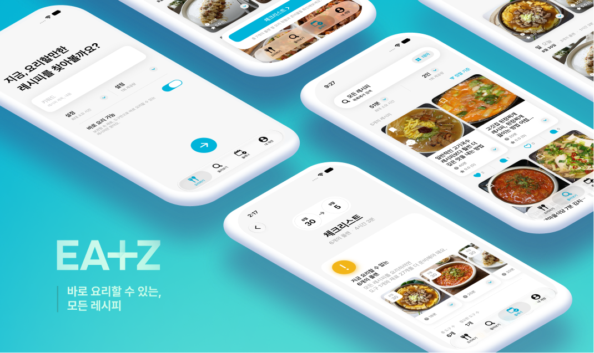
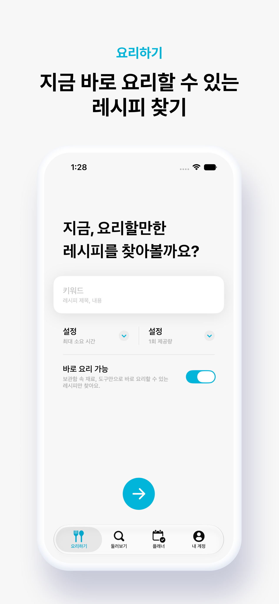
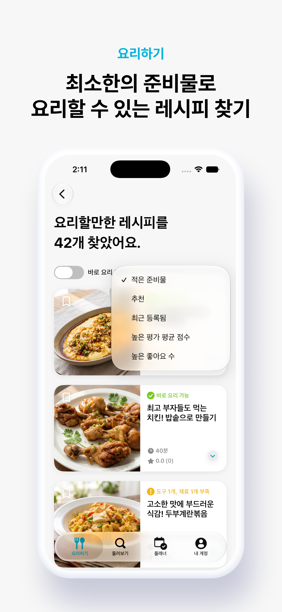
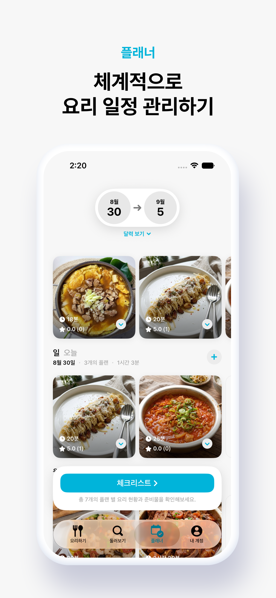
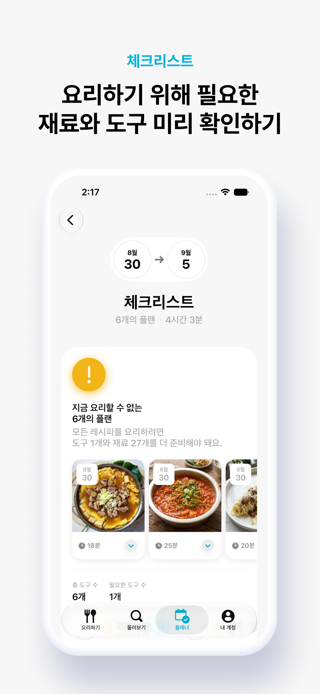
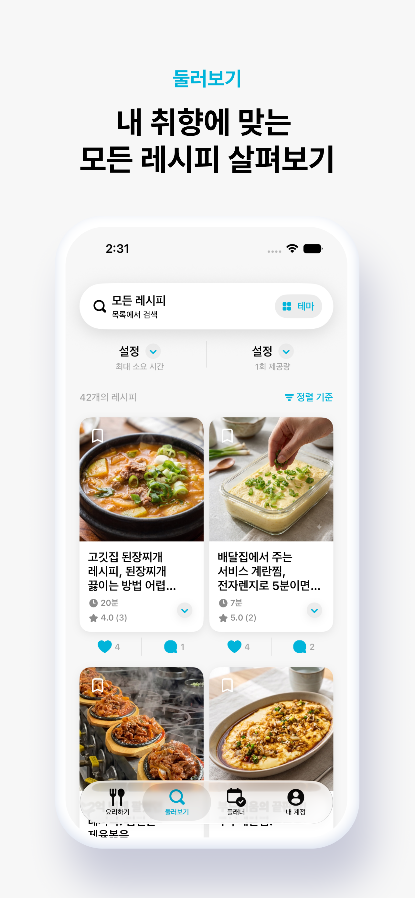
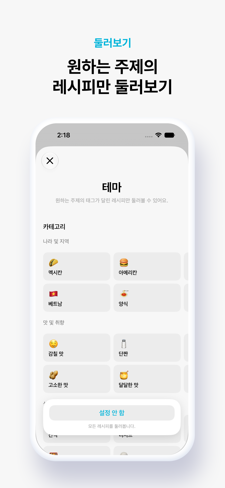
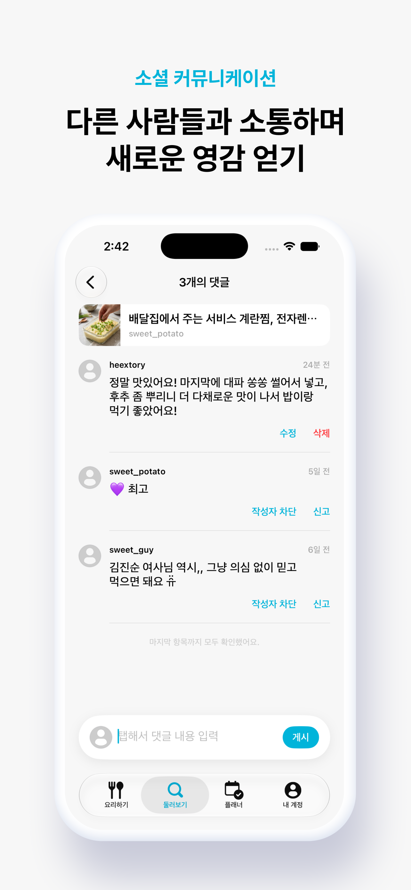
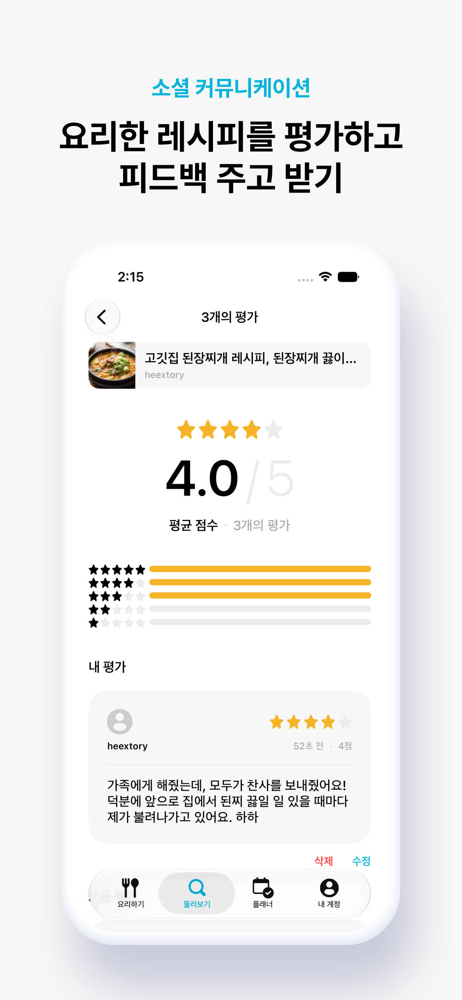

# EATZ iOS 클라이언트

사용자가 현재 보유한 재료와 도구를 기반으로 지금 요리할 수 있는 레시피를 둘러보거나 플래너로 요리 일정을 관리하고, 자신만의 레시피를 공유할 수 있는 소셜 레시피 플랫폼 EATZ의 iOS 애플리케이션입니다. 
EATZ API 웹 서버 [eatz-server](https://github.com/imWhS/eatz-server)와 통신하는 클라이언트이기도 합니다.

 

  

 

  
  
  
  
  
  
  
  

| 카테고리 | 스택 및 기술 |
| --- | --- |
| 언어 | Swift |
| UI 프레임워크 | SwiftUI |
| 주 아키텍처 | MVVM |
| 인증 | JWT |

## 주요 특징

- SwiftUI 기반의 MVVM 아키텍처를 사용합니다.
- `AuthManager`를 통해 앱 전역의 인증 상태와 사용자 세션을 관리합니다.
- `SystemManager`를 통해 앱 생명 주기, 딥 링크 등의 시스템 이벤트를 관리합니다.
- 앱이 foreground 상태로 전환될 때 서버와 통신해 세션 유효성을 자동으로 검증합니다.
- 로그인하지 않은 사용자도 주요 화면에 접근하고, 주요 기능을 사용할 수 있도록 게스트 모드를 지원합니다.
- 서버와 통신 중 세션 만료가 감지되면 사용자에게 재로그인 의사를 물어봅니다.
- 로그아웃하면 전역 인증 상태가 자동으로 게스트 모드로 전환되지만, 사용자가 접근 중이던 화면이나 사용 중이던 기능을 가능한 한 유지합니다.
- JWT 기반 액세스 토큰 / 리프레시 토큰 인증 방식을 사용합니다.
